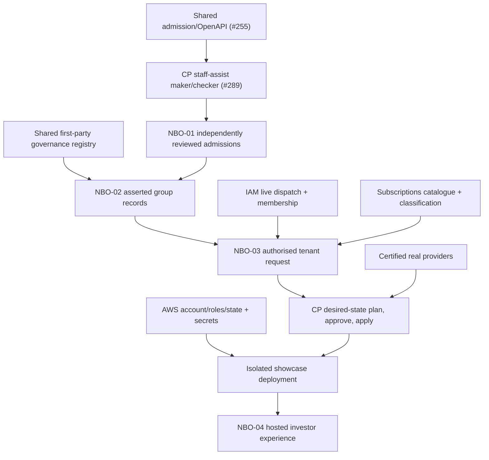

# NBO-00 — Dependencies and Critical Path

## Sequence

## Blocking prerequisites

| Dependency | Owner | State as observed | Required handoff |
|---|---|---|---|
| Staff-assisted contract | Shared #255 | PR proposed | CI pass, merge, version/pin and generated client |
| Governance and maker/checker implementation | CP #289 | PR proposed | migration, Go/PostgreSQL tests, review and CI |
| Nabhold incorporation claims | Shared #252 + corporate secretary | claimed, sign-off pending | verified source evidence; never auto-promote |
| ZuriBeans incorporation | registrar/business | application reportedly pending | separate Organisation claim from legal existence |
| Equator & Estate incorporation | corporate secretary | unverified | independently supported claim and verification |
| Verified control for INTERNAL subscriptions | CP governance + evidence owner | not evidenced for all subsidiaries | reviewed corporate basis and eligibility |
| IAM external principal / membership | IAM #106 and staging operator | integration pending | successful issuer/audience revocation proof |
| Subscription to ERP | Subscriptions → CP orchestration → ERP provider | integration pending | never direct Subscriptions-to-ERP write |
| AWS staging/showcase account | infrastructure/account owner | BLOCKED_EXTERNAL_DEPENDENCY | account ID, plan/apply OIDC role ARNs, state bucket, approved DNS, secrets and consent |
| Visitor access | IAM, CP, Console | not verified | restricted scopes, read-only projection, no admin commands |

## Independence and recovery

- NBO-00 documents and NBO-01 staff draft creation do not need AWS.
- NBO-02 declaration/claimed graph can proceed while legal evidence is pending; it must not create verified control, production access or INTERNAL pricing.
- NBO-03 must certify one subsidiary vertically, not fabricate provider health for all engines.
- NBO-04 must label each path live, synthetic, simulated or unavailable, and stay inaccessible to uninvited users.
- All PRs are review-only; no automatic merges or changes to deployed/production authority.

## Open reconciliation decisions

1. CP's existing admission contract requires at least one registration identifier to **submit** a ClientApplication. A pending-registration organisation such as ZuriBeans can be drafted, but cannot yet complete that ordinary submitted lifecycle without a truthful alternate policy/contract. Treat as a **contract/policy gap**: do not invent an incorporation identifier.
2. A full time-bound ComplianceException authority does not follow from the existence of ADR-BCP-023. Implement it separately, with explicit non-waivable restrictions.
3. Corporate group membership and verified first-party ownership cannot be inferred from registry role: `subsidiary` is not `VERIFIED CONTROL`.
