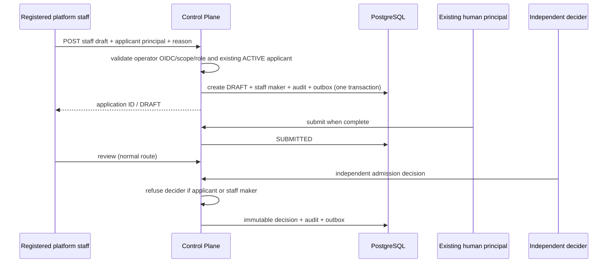

# NBO-01 — Governed Staff-Assisted Admission (first implementation slice)

## This increment

`POST /v1/admission/applications` permits a **registered platform administrator** with `admission:review` to create an `ASSISTED_ENTERPRISE` or `INTERNAL_GROUP` ClientApplication **DRAFT** for a registered, ACTIVE human applicant principal. The creation request contains a human-readable reason, idempotency key, existing applicant ID and a contract-valid ClientApplicationDraft.

No company number, registered office or evidence claim is inferred. This route does not approve admission, verify a legal entity, activate a market, create a subscription or mint a tenant. In particular, `INTERNAL_GROUP` is an **application channel**, never a subscription type.

## State and security sequence

## Provenance and concurrency

Migration `000101_staff_application_maker.sql` adds `opened_by_staff_principal_id` to the existing admission aggregate with an FK to the principal registry, and a CHECK ensuring maker is not applicant. All application read paths return it as an optional field. The decision service checks both applicant and staff maker under the same row lock as the decision update, not just before queueing. A repeated Idempotency-Key for the same applicant and same request returns the same application; a changed request conflicts.

## Deferred (not implemented by NBO-01)

- No `ComplianceException` workflow, showcase authorisation or production eligibility bypass.
- No incomplete-registration submission path yet: existing Shared contract requires an identifier on submission; NBO-02 fixture must leave unknown identifiers absent and the application in DRAFT.
- No new IAM issuer, token bypass, first-party pricing inference or company verification.
- No live tenant, provider, real-money financial transaction or investor access.

## Verification

`internal/service/application/staff_test.go` tests PostgreSQL provenance, replay, prohibited channel, unauthorised applicant and independent decider. `api/client_application_handler_test.go` denies applicants/unregistered staff before mutation. Must pass in CI with `TEST_DATABASE_URL`; deployment proof remains separate.
