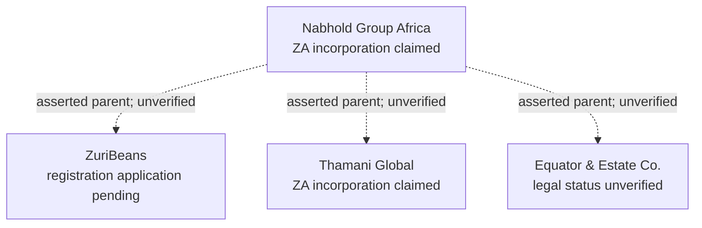

# NBO-02 — Founding Enterprise Topology: Claim-Only Intake

## Current executable boundary

- Manifest: `docs/showcase/fixtures/nabhold-group-v1.json`
- API-only runner: `scripts/showcase/nbo_apply.py`
- Unit tests: `scripts/showcase/test_nbo_apply.py`
- Required backend: NBO-01 `POST /v1/admission/applications` (Shared #255, CP #289).

This **does not complete NBO-02 canonical registration**. It prepares idempotent, reviewable *application drafts* without unsupported legal identities, invented principal IDs, directly inserted organisations, assumed corporate control or invented tenant IDs.

## Declared corporate structure



The dashed edges are **business-provided assertions**, not verified CP CorporateRelationships, derived CorporateGroupMemberships, PlatformRelationships, entitlements or IAM relationships.

## Execution (restricted, authorised staff)

Dry-run with no identities or credentials:

```sh
python3 scripts/showcase/nbo_apply.py --manifest docs/showcase/fixtures/nabhold-group-v1.json
python3 -m unittest discover -s scripts/showcase -p 'test_nbo_*.py'
```

Only once each organisation has an existing **ACTIVE human CP applicant principal** and the staff caller is an existing platform administrator with `admission:review`:

```sh
python3 scripts/showcase/nbo_apply.py \
  --manifest docs/showcase/fixtures/nabhold-group-v1.json \
  --apply \
  --base-url https://<non-production-control-plane-host> \
  --applicants /secure/nbo-applicants.json \
  --token-file /secure/operator-short-lived-token \
  --receipts /secure/nbo-receipts.json
```

`nbo-applicants.json` is a local JSON mapping from exact `fixture_key` values to **already registered principal UUIDs**. Do not commit it or the token. The script refuses missing identities, unknown fields, HTTP downgrade, channels outside staff authority, and stale/changed local receipts.

The API mints `capp_...` IDs; a stable Idempotency-Key per fixture item ensures exact replay for an unchanged applicant. Changed payloads with the same key must be stopped for human review. If the applicant principal mapping changes or receipts are lost, an operator must reconcile prior intake before any reissue (server-side idempotency is principal-scoped, not universal).

## Current status and required next gate

| Concern | Current result |
|---|---|
| Nabhold and three subsidiary business claims | Declarative DRAFT input only |
| ZA incorporation claimed for Nabhold/Thamani | Recorded only as application-scoped assertions if applied |
| ZuriBeans pending application | No registration number fabricated |
| Equator incorporation | Unverified and no jurisdiction guessed |
| Corporate ownership | Declarative **unverified** parent references, no authorised relationship edge written |
| ZA and UG market participation | Intent represented, no legal presence/selling/exporting rights |
| Canonical Organisation IDs | **Not minted** by fixture; require governed admission after independent decision |
| PlatformAccount / Tenant / INTERNAL entitlement | **Not created** |
| Backend mutation / live runtime tests | Blocked until secured CP API, applicants and identities are provisioned |

Next NBO-02 increment: after admissible evidence is present and independently reviewed, exercise CP's existing `AdmissionOnboarder` and OrganisationRepository through authorised APIs to mint/resolve organisations, preserve pending relationship verification, bind PlatformAccount via its own lifecycle and record market intent. If the submitted-application schema blocks pending incorporation, evolve Shared's policy with explicit non-incorporated organisation semantics; do not make up a company number.
